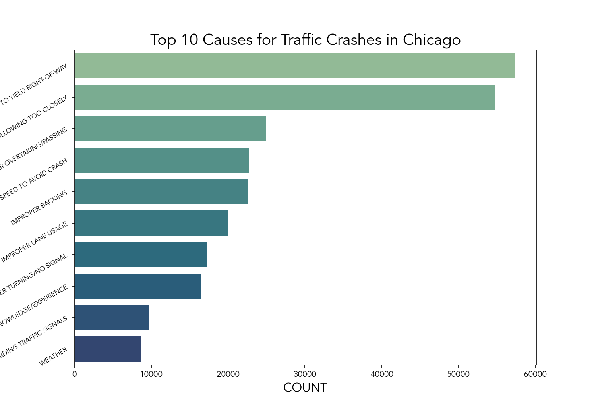
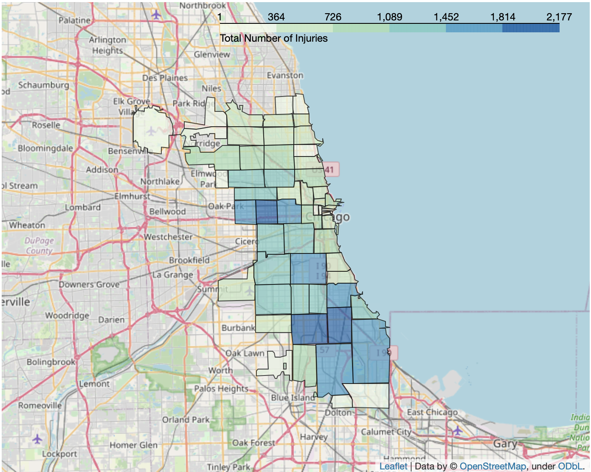
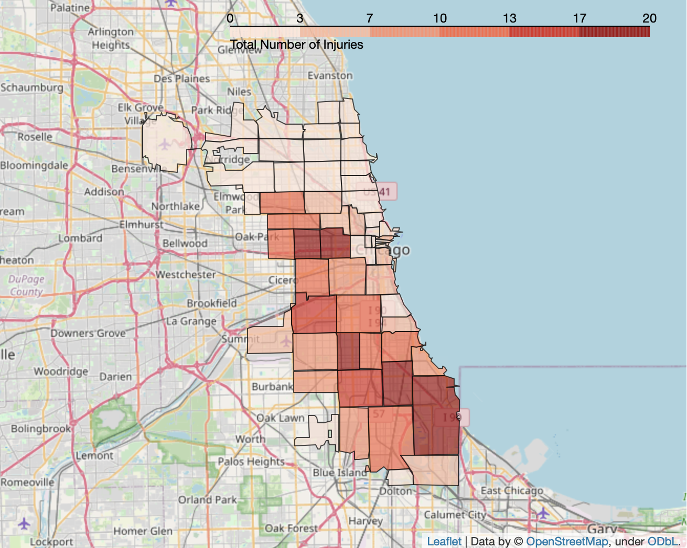
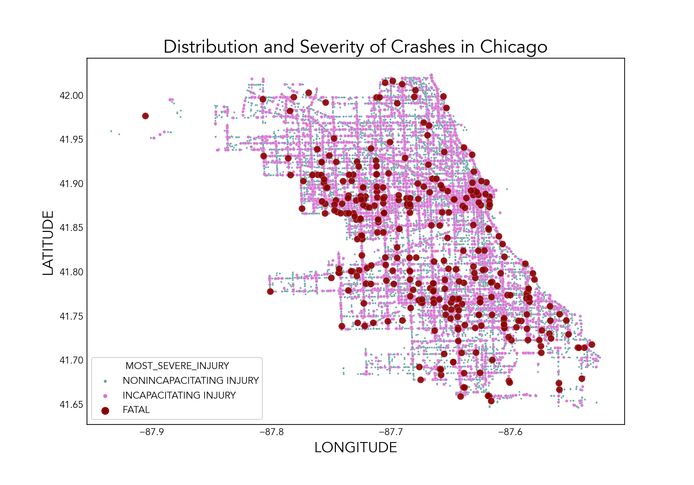

# **Chicago Traffic Crashes: Classification of Vehicular Crashes by Primary Cause**

Ian Sharff

## Table of Contents
* [Overview](#overview)
* [Business Understanding](#business-understanding)
* [Data Understanding and Preparation](#data-understanding-and-preparation)
* [Model Training and Testing](#model-training-and-testing)
* [Conclusions and Future Expansion Ideas](#conclusions-and-future-expansion-ideas)
* [Project Structure](#project-structure)


## Repository Links
* [Data](/data)
* [Model Evaluator Class](/models.py)
* [Images](/images)
* [Data Dictionaries](/data/data_dictionaries)

## Overview
The objective of this project is to develop an effective, multi-class classification model for the Chicago Traffic Crashes Dataset available from the <a href="https://data.cityofchicago.org/Transportation/Traffic-Crashes-Crashes/85ca-t3if">Chicago Data Portal</a>. This dataset is vast in size, containing detailed information on roughly 500,000 traffic crashes since 2015 when the dataset was first created. In particular, this study is concerned with predicting the primary contributory causes of these various accidents. A highly efficient model that could deduce the most salient cause of a car crash could be helpful for crash report formulation. In addition, it could be used to distinguish the factors that are widespread among all crashes as well as those that are particular to crashes arising from given circumstances.

## Business Understanding
This study is framed from the point of view of the governmental agencies of the city of Chicago, namely those behind the <a href="https://www.chicago.gov/city/en/depts/cdot/supp_info/vision-zero-chicago.html">Vision Zero Chicago</a> initiative, which is dedicated to reducing (or ideally, eliminating) fatal and incapacitating injuries arising from tragic, and largely avoidable traffic accidents. The purpose of this project is, thus, to provide the city of Chicago with valuable insight regarding the most causatory factors of fatal and non-fatal traffic crashes, as well as a predictive model that can be used in cases where an officer is not available to make a judgement regarding the most likely primary cause. In a perfect world, every car crash would easily be assigned a primary cause with sound judgement from those who report them. However, this dataset makes it abundantly clear that the realm of automobile accidents is far from perfect. A sizeable portion of the data does not contain a primary cause associated with a given crash. This could be due to a variety of reasons, one being a lack of eyewitness testimony. A classification model that could hypothesize a general primary cause could help to fill in the gaps of the data and create a more holisitc view of the problem at hand.

## Data Understanding and Preparation
As previously mentioned, the data available for this study is immense. Roughly 500,000 car crashes are documented in the crashes dataset, along with companion databases pertaining to the roughly 1,000,000 people and vehicles involved in these crashes. Given less than a week to derive meaningful insight and recommendations from the data, it was decided that just information from the crashes dataset would be sufficient for an initial exploration and modeling attempt. From basic data exploration, some important features were determined from the crashes data. Namely:

  * Injury counts (`INJURIES_TOTAL`, `INJURIES_FATAL`) and severity (`MOST_SEVERE_INJURY`)
  * Environmental conditions (`WEATHER_CONDITION`, `LIGHTING_CONDITION`, `ROADWAY_SURFACE_CONDITION`, etc.)
  * Cost of related damage (`DAMAGE`)
  * Traffic control device and its condition (`TRAFFIC_CONTROL_DEVICE`, `DEVICE_CONDITION`)
  * And others
 
In addition, data dictionaries were created using the HTML table files on each website so that variable descriptions could be made easily available. The code for that is located [here](/data/data_dictionaries)

In total, the crashes dataset contains _49_ features, and the primary key that links the crashes dataset to the vehicles and people datasets is `CRASH_RECORD_ID`. Binary columns end in `_I` and each contain `'Y'`, `'N'`, or are missing values, i.e. `NaN` when using Pandas. In the subset of features used, it could be reasonably assumed that a missing value is equivalent to `'N'`. For instance, in the `HIT_AND_RUN_I` column, it was assumed that if a crash involved a hit-and-run, it would have been reported. While this may not be true for all data points, many of these columns had over 95% missing values, and the information would have been lost otherwise. Initial data cleaning is contained in the [trim_crashes.py](#trim_crashes.py) file, which processes the original large crashes CSV file that is not contained in this GitHub repository due to it being over 100 MB.

Another important aspect of processing was binning the causes (see [bin_causes.py](#bin_causes.py)), since there were a large number of primary contributory causes that could not all be evaluated effectively by a classification model. This script stores a dictionary mapping all original documented causes to the newly binned causes, which are denoted `DRIVER` (driver's inattention to other individuals/ driver impairment), `DISREGARDING_SIGNS` (driver's inattention to traffic signals and/or signage and lane markings) and `ENVIRONMENT` (cases in which the primary cause is due to the environmental circumstances). The top ten original causes are shown below



From this image, it's clear that most crash records put the driver at fault, while only the tenth cause, `WEATHER` is indicative of an environmental cause for the crash. The data coordinates of these locations was also used to visualize the distribution of crashes resulting in injuries to provide helpful recommendations for the city of Chicago in their efforts to reduce car crashes. The blue map on the left represents total injuries, while the red indicates only fatal injuries. Also, a scatterplot was produced that generally indicates that fatal crashes seem to occur in clusters, which provides inspiration for further work using unsupervised learning.

 



Other useful visualizations are contained in the [visualizations notebook](03_visualizations.ipynb)


## Model Training and Testing

All models were constructed using a combination of tools and models from the `sklearn` and `imblearn` Python libraries, and full examples are stored in the [modeling notebook](/02_modeling.ipynb) and [main notebook](/01_chicago_crashes.ipynb), with the former actually fitting the models, and the latter using the pickled model files to avoid added computation time. The models employed were:

* A dummy classifier with stratified predictions as a baseline (`sklearn.dummy.DummyClassifier`)
* A simple decision tree classifier (`sklearn.tree.DecisionTreeClassifier`)
* A decision tree classifier using SMOTE to counter the large class imbalance in the data (`imblearn.over_sampling.SMOTE`)
* A gradient boosting classifier, also using SMOTE (`sklearn.ensemble.GradientBoostingClassifier`)

Each model was evaluated using a custom model evaluator class (`ModelEvaluator`) that was intended to streamline the modeling process. The source code for this class is located in [models.py](models.py). Classification reports were generated for each of the models, and special focus was given to the F-1 scores due the class imbalances. The best overall model was the gradient boosting classifier, having a similar accuracy on the train and test sets compared to the initial decision tree classifier demonstrating superior selectivity for the minority classes. However, the final model is still in need of tuning, and there remains a great deal of work to be done to produce a highly accurate and selective model that is capable of identifying each class effectively.

## Conclusions and Future Expansion Ideas
For the business problem at hand, i.e. reducing the occurence of car crashes resulting in fatal or incapacitating injuries in Chicago, the most useful recommendations came from the initial exploratory analysis, while the models serve as a starting point for creating a tool that could greatly improve the data available in the Chicago Data Portal. In the future, this project could be greatly expanded by: 

* Merging all three datasets to increase the data diversity
* Utilizing unsupervised learning techniques to identify geographical clusters where fatal and injury-causing crashes are more likely to occur
* Redefining the class groupings in order to segment off the majority class, i.e. `DRIVER`
* Performing extensive hyperparameter tuning on models and using a greater variety of models, including custom ensemble techniques.
## Project Structure
```
.
├── 01_chicago_crashes.ipynb
├── 02_modeling.ipynb
├── 03_visualizations.ipynb
├── bin_causes.py
├── data
│   ├── binned_causes.pkl
│   ├── crashes.pkl
│   ├── crashes_injuries.pkl
│   ├── data_dictionaries
│   └── raw
├── fitted_models/
├── images/
├── models.py
├── presentation_slides.pdf
└── trim_crashes.py
```
